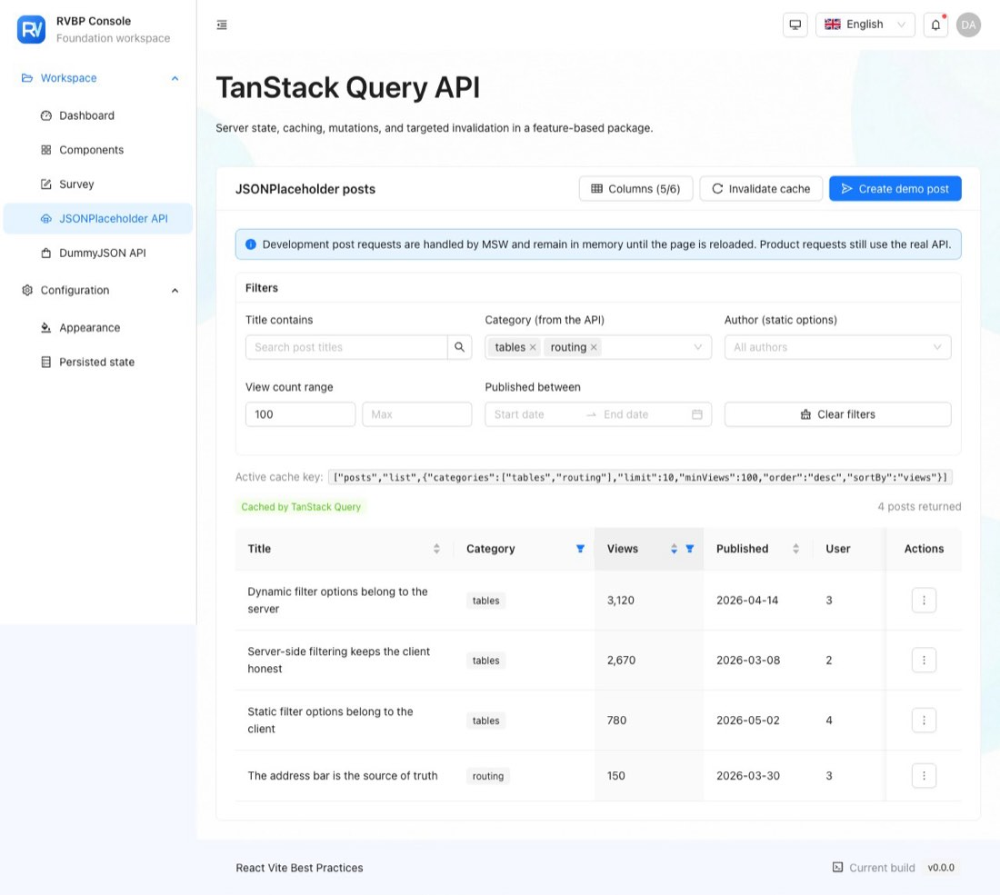
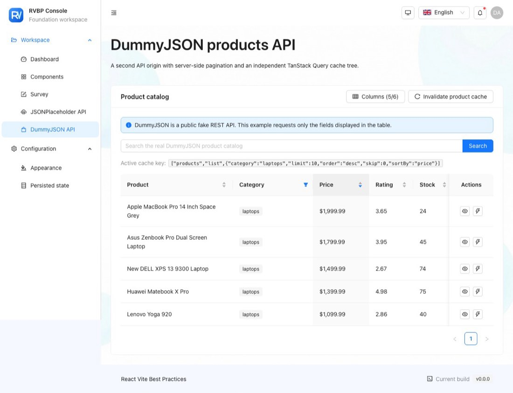
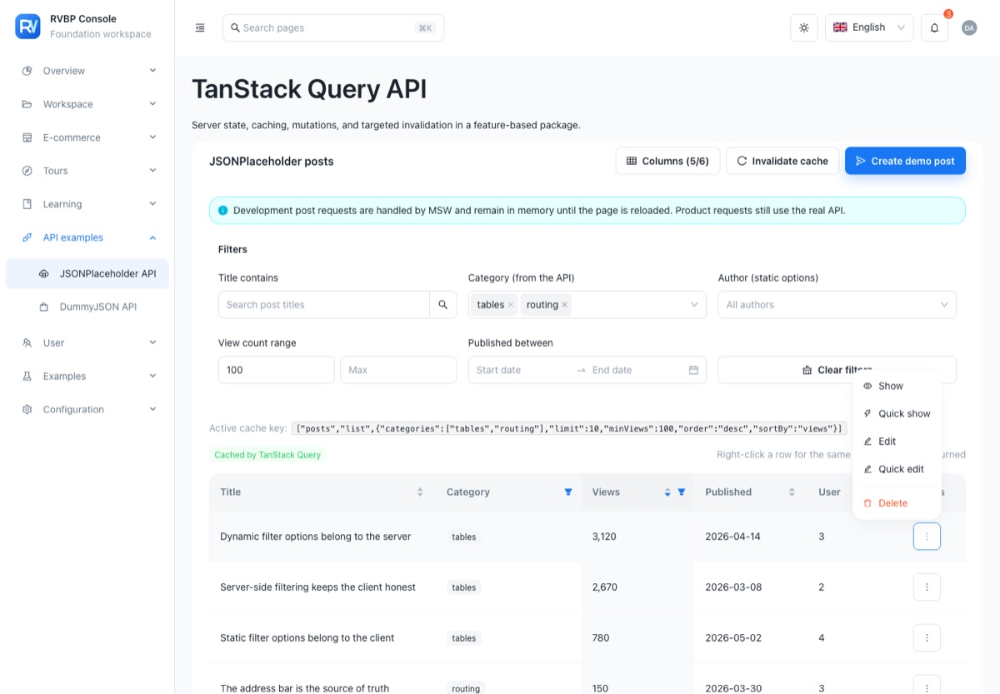
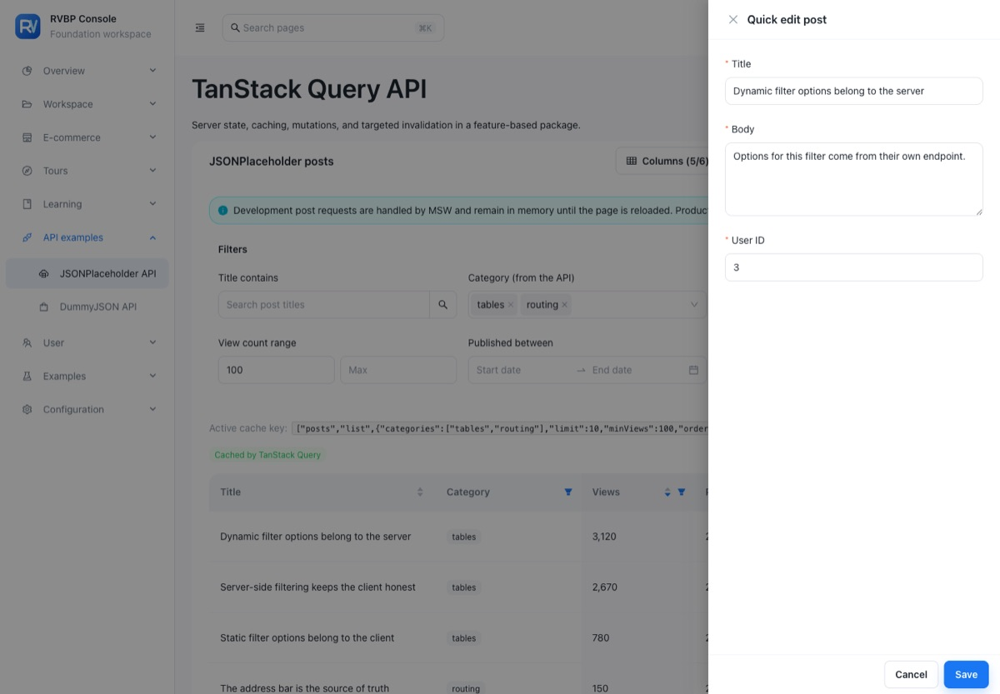
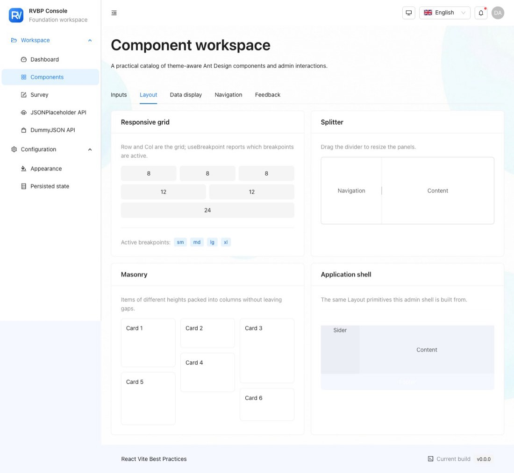
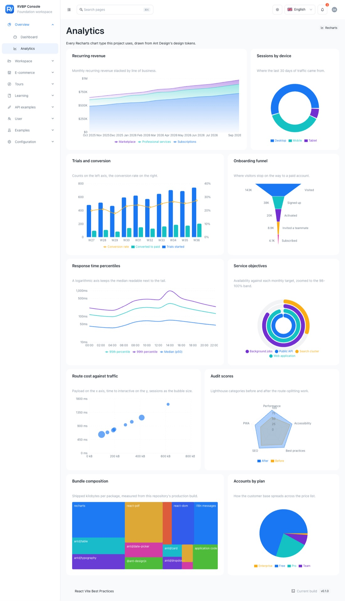
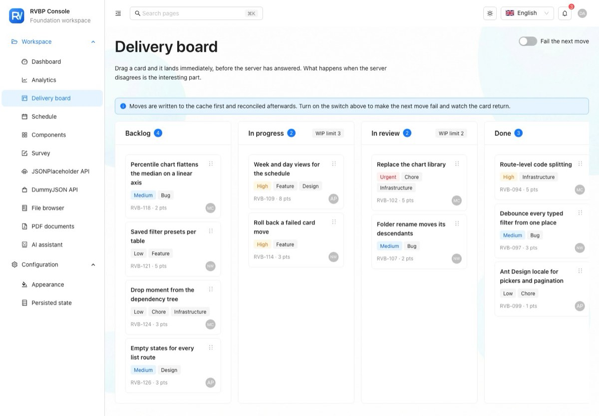
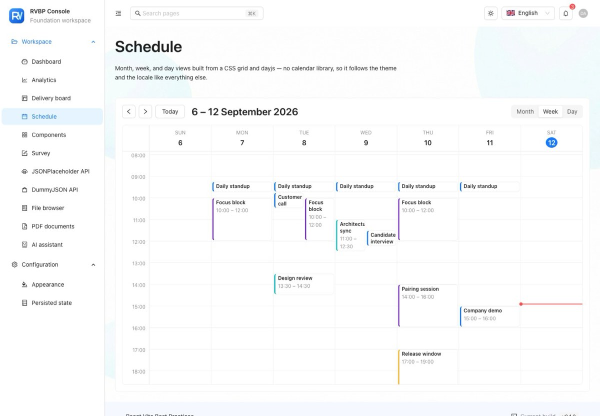
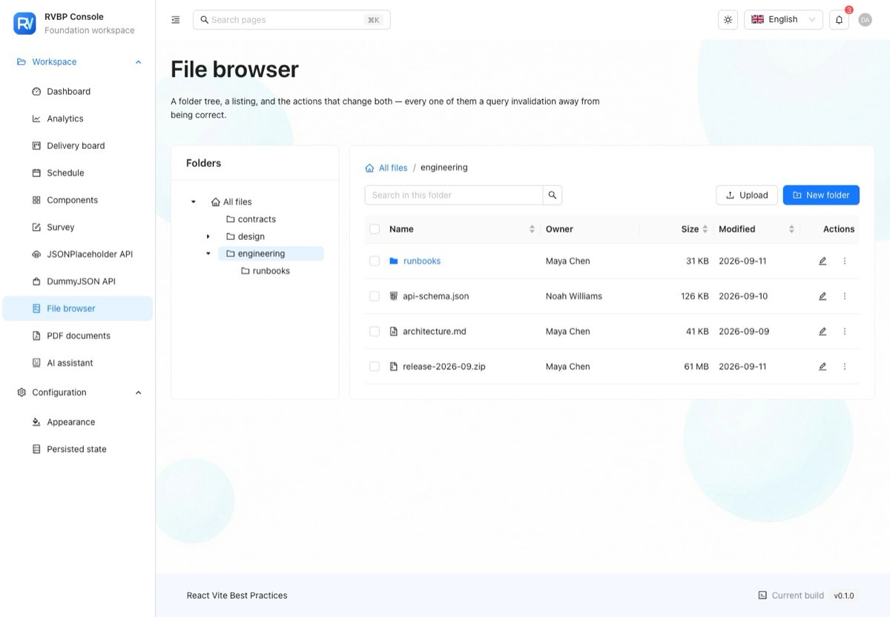
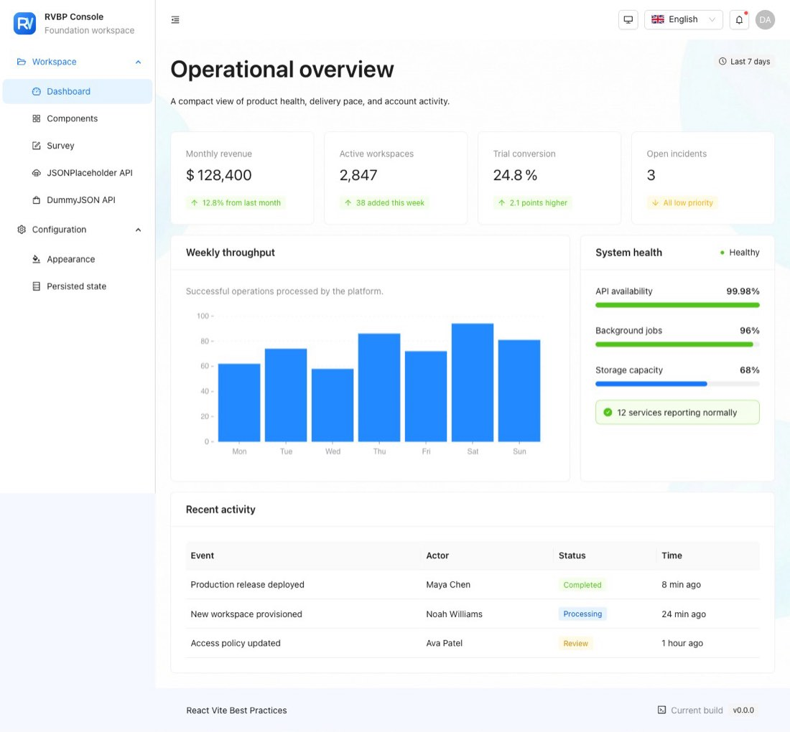

# React Vite Best Practices

A documented and tested foundation for production-ready React applications.



## Quick start

```bash
pnpm install
pnpm dev
```

## Quality checks

```bash
pnpm check          # typecheck, lint, format, tests
pnpm test:coverage
pnpm build
```

## Run the production container

```bash
docker compose up --build   # http://localhost:8080
```

The image builds with Node and pnpm, then serves only the generated static files from
Nginx. See [022](docs/022-docker-nginx-production-deployment.md).

## What it demonstrates

Two list pages solve the same problems differently, so each trade-off has a working
example rather than a rule to memorize.

|                  | Posts                                 | Products               |
| ---------------- | ------------------------------------- | ---------------------- |
| API              | MSW handlers                          | Real DummyJSON service |
| Row actions      | Five, in an overflow menu             | Two, inline icons      |
| Filter options   | Categories fetched, authors hardcoded | Categories fetched     |
| Filter placement | Panel above **and** column headers    | Column headers         |

### Server-side filtering, sorting, and pagination

Every filter lives in the address bar, so a filtered list can be linked, reloaded, and
walked back through with the browser's own history. Sorting and filtering are sent to
the API rather than applied to the page already in memory, and typed filters commit on a
shared debounce instead of firing a request per keystroke.



### Detail routes and quick surfaces

"Show" and "Edit" navigate to a route, so the address can be copied and reloaded. "Quick
show" and "Quick edit" open a modal and a drawer over the list, so the reader keeps their
filters and scroll position. Both read the same detail query.

<p>
  
  
</p>

### A broad Ant Design component catalog

`/components` demonstrates commonly used Ant Design components across five groups, so a component
can be seen working in this theme before it is reached for.



### Ten chart types on one page

`/analytics` draws area, line, composed, pie, donut, radar, radial, scatter, treemap, and
funnel charts from Recharts, coloured from Ant Design's design tokens so they follow every
theme and dark mode. Replacing `@ant-design/charts` with it cut the dashboard chunk from
1.43 MB to 356 kB — the measurements are in [013](docs/013-charts-with-recharts.md).



### A file browser, a board, and a schedule

Three screens that exist for what is hard about them rather than for the widgets. The file
browser ([027](docs/027-file-browser.md)) is a tree beside a listing where a rename moves a
whole subtree and both views have to agree afterwards. The delivery board
([028](docs/028-kanban-and-optimistic-updates.md)) writes a dragged card into the cache
before the server answers and rolls it back when the server disagrees — there is a switch
to make that happen on demand. The schedule ([029](docs/029-calendar-without-a-library.md))
has month, week, and day views built from a CSS grid and dayjs, with no calendar library,
so it follows the theme and the locale like everything else.

<p>
  
  
</p>



### An admin shell with persistent preferences



## Included foundations

- React, Vite, and TypeScript
- Typed environment configuration and build-time feature flags
- Source path aliases
- TanStack Query for server state, caching, mutations, and targeted invalidation
- MSW for a mocked API that runs beside the real one
- Ant Design and persistent visual themes
- A working catalog of the full Ant Design component set
- Ten Recharts chart types themed from Ant Design's design tokens
- A file browser with a folder tree, uploads, renames, and subtree deletes
- A drag-and-drop board with optimistic updates, rollback, and keyboard dragging
- Month, week, and day calendar views written without a calendar library
- PDF viewing with pdf.js, from a blob fetched through the API client
- An AI chat screen built from Ant Design X, with streamed and cancellable replies
- A header search over one shared navigation definition, with a ⌘K shortcut
- Responsive Ant Design data-layout patterns without internal CSS overrides
- React Router data routing, detail routes, and an admin dashboard demo
- List state in the URL: pagination, search, filters, and sorting
- Column visibility stored per table as a reader preference
- A standalone landing page at `/`, separate from the admin dashboard
- Lazy-loaded route modules with shared Suspense loading states
- Login, registration, OTP, survey, and 404 example pages
- Zustand state management for language and appearance preferences
- JSON-based internationalization (English and Turkish), including Ant Design's own strings
- Docker and Nginx production deployment
- Oxlint and Oxfmt
- Vitest and React Testing Library
- Root error handling
- Git hooks and Conventional Commits
- Custom product metadata and favicon assets

Each decision is explained incrementally in [`docs`](./docs/).
